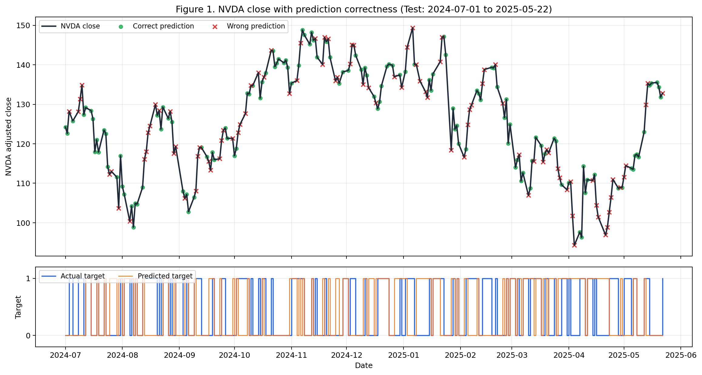

# NVDA 주가 방향 예측 모형 개발 보고서

## 1. 서론

본 프로젝트의 목적은 NVIDIA(NVDA)의 단기 주가 움직임을 예측하는 이진 분류 모형을 개발하는 것이다. NVIDIA는 2023년 이후 생성형 AI와 데이터센터 투자 확대의 핵심 수혜 기업으로 평가되면서, 개별 기업 실적뿐 아니라 반도체 섹터, 나스닥 기술주, 금리, 변동성 지수의 영향을 동시에 받는다. 따라서 단순히 NVDA의 과거 가격만 보는 방식보다, 시장 전체 흐름과 비교한 상대적 강도를 함께 고려하는 접근이 필요하다.

초기 실험에서는 `NVDA가 다음 거래일에 상승하는가`를 타깃으로 두었다. 그러나 일별 주가에는 작은 잡음성 상승과 하락이 많아, 방향 자체를 맞히는 문제는 예측력이 제한적이었다. 이에 최종 모형에서는 먼저 QQQ 대비 초과수익률을 회귀로 예측한 뒤, 이를 분류 기준으로 변환했다.

```text
y_reg = NVDA 일별 수익률 - QQQ 일별 수익률
y_pred_class = 1 if predicted y_reg > validation-selected threshold
               0 otherwise
```

최종 평가는 `실제 NVDA 일별 수익률 - QQQ 일별 수익률 > 0.2%p` 여부를 기준으로 수행한다. 즉, 최종 모형은 "NVDA가 단순히 올랐는가"가 아니라 "NVDA가 QQQ보다 의미 있게 강했는가"를 예측한다. 이 정의는 NVDA의 절대 방향보다 시장 대비 초과 성과를 평가하는 데 적합하며, 실제 투자 관점에서는 NVDA overweight 또는 long NVDA / hedge QQQ 전략과 연결된다.

## 2. 데이터 및 변수 정의

분석 기간은 2020년 1월 9일부터 2025년 5월 22일까지이며, 학습·검증·테스트 구간은 시간 순서대로 분리했다. 무작위 분할은 사용하지 않았다.

| 구간 | 기간 | 거래일 수 | 목적 |
|------|------|----------|------|
| Train | 2020-01-09 ~ 2023-06-30 | 875일 | 모형 학습 |
| Validation | 2023-07-03 ~ 2024-06-28 | 250일 | 하이퍼파라미터 및 threshold 선택 |
| Test | 2024-07-01 ~ 2025-05-22 | 225일 | 최종 평가 |

사용한 설명 변수는 총 22개이며, 시장 데이터는 lookahead bias를 막기 위해 모두 `shift(1)` 처리했다. 즉, 예측 시점에는 전일 장마감까지 알려진 정보만 사용한다.

| 범주 | 주요 변수 |
|------|-----------|
| NVDA 기술지표 | 1일 수익률, 20일 이동평균 대비 괴리율, 거래량 비율, RSI, MACD |
| 상대강도 | NVDA_vs_QQQ, NVDA_vs_SOX |
| 변동성 | 20일 실현 변동성, VIX, VIX 변화량 |
| 섹터/동종 종목 | SOX, TSM, QQQ, MSFT, META 수익률 |
| 매크로 | 미국 10년물 금리, DXY 수익률, CPI |
| 이벤트 | NVDA 실적 발표 전후, FOMC, CPI 발표일 |

추가로 모형 비교 과정에서는 LSTM, GRU, TCN, iTransformer-style 모형을 사용할 때 20일 window를 적용했다. 이 경우 test 앞 20일이 sequence 생성에 사용되므로 평가 표본 수는 205일이다.

## 3. 분석 방법

분석은 세 단계로 진행했다.

첫째, 기존 방향 타깃과 대체 타깃을 비교했다. 비교한 타깃은 `NVDA 수익률 > 0`, `NVDA 수익률 > 0.2%`, `NVDA 수익률 - QQQ 수익률 > 0`, `NVDA 수익률 - QQQ 수익률 > 0.2%p` 네 가지다.

둘째, 여러 모형을 같은 train/validation/test 구간에서 비교했다. 비교 모형은 Logistic Regression, XGBoost, MLP, TCN, LSTM, GRU, iTransformer-style classifier다. 모든 모형은 validation set에서 threshold를 선택하고, test set은 최종 평가에만 사용했다.

셋째, 개선 가능성이 가장 높은 Logistic Regression과 XGBoost를 우선 튜닝했다. 이후 방향만 분류하는 한계를 보완하기 위해 초과수익률 자체를 먼저 예측하는 회귀 접근을 추가했다. Ridge, ElasticNet, Huber, XGBoost Regressor, LightGBM Regressor, HistGradientBoosting Regressor를 비교했으며, 최종 선택된 모형은 Huber Regression을 이용한 회귀 후 분류 모형이다. 트리 기반 회귀(XGBRegressor, LGBMRegressor, HistGBR)는 validation ROC-AUC가 0.50 이하로 학습 패턴이 반전돼 선형 모형에 비해 불안정했다.

## 4. 주요 분석 결과

### 표 1. 정밀도 평가표 및 주요 성능 비교

| 구분 | 타깃 | 모형 | Test n | Accuracy | Precision | Recall | F1 | ROC-AUC | MCC |
|------|------|------|--------|----------|-----------|--------|----|---------|-----|
| 최종 모형 | NVDA - QQQ > 0.2%p | Huber 회귀→분류 | 225 | **60.44%** | **0.595** | 0.427 | 0.497 | 0.578 | **0.192** |
| 기준 모형 | NVDA return > 0 | LR | 225 | 53.33% | 0.547 | 0.636 | 0.588 | 0.558 | 0.058 |
| 비교 모형 1 | NVDA - QQQ > 0.2%p | Tuned LR | 225 | 58.22% | 0.547 | 0.505 | 0.525 | 0.603 | 0.154 |
| 비교 모형 2 | NVDA - QQQ > 0.2%p | LR | 225 | 57.33% | 0.531 | 0.583 | 0.556 | **0.610** | 0.148 |
| 비교 모형 3 | NVDA - QQQ > 0 | XGBoost | 225 | 56.00% | 0.628 | 0.246 | 0.353 | 0.601 | 0.135 |
| 비교 모형 4 | NVDA - QQQ > 0.2%p | LSTM | 205 | 54.15% | 0.507 | 0.792 | 0.618 | 0.594 | 0.127 |

최종 Huber 회귀→분류 모형은 Accuracy 60.44%를 기록했다. 과제 기준상 58% 이상 구간에 해당하므로 예측력 평가에서 가장 높은 구간을 목표로 제시할 수 있다. Precision은 0.595로, 모형이 "NVDA가 QQQ보다 0.2%p 이상 강하다"고 예측한 날 중 약 59.5%가 실제로 맞았다.

ROC-AUC만 보면 일반 LR이 0.610으로 가장 높았지만, Huber 회귀→분류 모형은 Accuracy와 MCC가 가장 높고 Precision도 0.595로 높았다. 따라서 발표에서는 최종 실전형 모형을 Huber 회귀→분류로 제시하고, ROC-AUC 관점에서는 LR도 강한 비교 모형이었다고 설명하는 것이 적절하다.

### 그림 1. 실제 주가와 예측 정오 표시



그림 1은 test 기간의 NVDA 종가 추세 위에 Huber 회귀→분류 모형의 예측이 맞은 날과 틀린 날을 표시한 것이다. 위 패널은 실제 NVDA 종가이며, 초록색 점은 예측 성공일, 빨간색 x는 예측 실패일이다. 아래 패널은 실제 target과 예측 target을 0/1 선으로 표시한다. 이를 통해 단순 수치뿐 아니라 어느 구간에서 예측이 잘 맞고 틀렸는지 시각적으로 확인할 수 있다.

## 5. 비교 분석

본 과제 요구사항에 맞춰 두 가지 비교를 수행했다.

첫째, 타깃 정의를 비교했다. 기존의 `NVDA return > 0` 타깃은 LR 기준 Accuracy 53.33%, ROC-AUC 0.558에 그쳤다. 반면 `NVDA return - QQQ return > 0.2%p` 타깃은 Huber 회귀→분류 기준 Accuracy 60.44%, Precision 0.595를 기록했다. 이는 NVDA의 절대 방향보다 시장 대비 상대 강도를 예측하는 문제가 더 안정적이라는 점을 보여준다.

둘째, 모형을 비교했다. 분류 모형만 비교하면 Logistic Regression이 가장 방어 가능한 기준선이었다. 복잡한 신경망 모형인 LSTM, GRU, TCN, iTransformer-style classifier도 실험했지만 LR을 일관되게 넘지는 못했다. 최종 제출 모형은 여기서 한 단계 확장해 초과수익률을 먼저 예측하는 Huber 회귀→분류 방식으로 선택했다.

## 6. 강점 및 한계점

본 모형의 강점은 다음과 같다. 첫째, 시간 순서에 따른 train/validation/test 분할을 사용해 데이터 누수를 줄였다. 둘째, NVDA 단일 가격만 보지 않고 QQQ, SOX, TSM, 금리, VIX, 이벤트 캘린더 등 시장 구조를 반영했다. 셋째, 기존 방향 타깃뿐 아니라 QQQ 대비 초과수익 타깃을 비교해 더 예측 가능한 문제 정의를 찾았다. 넷째, 정밀도, Accuracy, ROC-AUC, MCC 등 여러 지표를 함께 제시해 모형 성능을 다각도로 평가했다.

한계점도 존재한다. 첫째, 거래비용과 슬리피지를 직접 반영하지 않았다. 둘째, 뉴스, 공시, 옵션 데이터, 애널리스트 리포트 같은 텍스트·수급 정보는 사용하지 않았다. 셋째, test 기간이 2024년 7월부터 2025년 5월까지로 제한되어 있어 다른 시장 국면에서도 같은 성능이 유지되는지는 추가 검증이 필요하다. 넷째, 최종 타깃은 "NVDA가 상승하는가"가 아니라 "NVDA가 QQQ보다 의미 있게 강한가"이므로, 투자 해석에서 hedge 또는 상대성과 전략이라는 점을 명확히 해야 한다.

## 7. 결론

최종적으로 본 프로젝트는 NVDA의 단순 상승/하락 예측보다 QQQ 대비 초과 성과 예측이 더 높은 예측력을 보인다는 결론을 얻었다. 최종 Huber 회귀→분류 모형은 test Accuracy 60.44%, Precision 0.595, ROC-AUC 0.578을 기록했다. 이는 단순 majority baseline 54.22%를 상회하며, 과제 예측력 기준에서도 58% 이상 구간에 해당한다.

발표에서는 "방향만 분류하기보다 초과수익률의 크기를 먼저 예측하고, 이후 투자 기준으로 분류하는 방식이 더 실용적이었다"는 메시지를 중심으로 설명하는 것이 좋다. 즉, 이 프로젝트의 핵심 기여는 더 복잡한 모형을 만드는 것보다, NVDA의 움직임을 시장 대비 상대 강도 문제로 재정의해 예측 가능성을 높였다는 점이다.

## 8. 5분 발표 구성안

| 시간 | 내용 | 핵심 메시지 |
|------|------|-------------|
| 0:00~0:40 | 서론 | NVDA는 AI·반도체·성장주 요인이 동시에 작용하므로 시장 대비 상대 강도 예측이 필요하다. |
| 0:40~1:30 | 데이터와 변수 | 2020~2025년 OHLCV, 섹터, 매크로, 변동성, 이벤트 피처 22개를 사용했다. |
| 1:30~2:30 | 방법론 | 기존 방향 타깃과 QQQ 대비 초과수익 타깃을 비교하고, 여러 모형을 같은 split에서 평가했다. |
| 2:30~3:40 | 표 1 결과 | 최종 Huber 회귀→분류 모형이 Accuracy 60.44%, Precision 0.595로 가장 실용적인 성능을 보였다. |
| 3:40~4:30 | 그림 1 설명 | 실제 NVDA 주가 위에 맞춘 날과 틀린 날을 표시해 모형의 동작 구간을 시각적으로 설명한다. |
| 4:30~5:00 | 강점과 한계 | 타깃 재정의와 시장 구조 반영이 강점이며, 거래비용·뉴스·옵션 데이터 미반영은 한계다. |
